# CSC 710 — Battleship Online Multiplayer

## Technical Design Document

**Version:** 1.0  
**Date:** February 8, 2025  
**Team:** Umut, Merve, Justin  
**Deadline:** February 25, 2025  
**Course:** CSC 710

---

## Table of Contents

1. [Project Overview](#1-project-overview)
2. [Tech Stack](#2-tech-stack)
3. [System Architecture](#3-system-architecture)
4. [Application Flow](#4-application-flow)
5. [Page & Screen Specifications](#5-page--screen-specifications)
6. [Database Schema](#6-database-schema)
7. [Authentication System](#7-authentication-system)
8. [Lobby System](#8-lobby-system)
9. [Matchmaking Engine](#9-matchmaking-engine)
10. [Game Mechanics](#10-game-mechanics)
11. [Realtime Event System](#11-realtime-event-system)
12. [React Component Architecture](#12-react-component-architecture)
13. [API & Supabase Functions](#13-api--supabase-functions)
14. [Responsive Design Strategy](#14-responsive-design-strategy)
15. [CI/CD Pipeline](#15-cicd-pipeline)
16. [Security Considerations](#16-security-considerations)
17. [Error Handling & Edge Cases](#17-error-handling--edge-cases)
18. [Project Timeline & Milestones](#18-project-timeline--milestones)
19. [Future Enhancements](#19-future-enhancements)

---

## 1. Project Overview

### 1.1 Description

A real-time, browser-based multiplayer Battleship game where players can join a lobby, find opponents through matchmaking or custom tables, and play the classic 10×10 grid naval combat game. The application features user authentication, live lobby status, FIFO-based matchmaking, private table creation with join-request approval, in-lobby text chat, player profiles with win/loss statistics, and a responsive UI that works across desktop and mobile devices.

### 1.2 Core Features

| Feature | Description | Priority |
|---------|-------------|----------|
| Landing Page | Engaging entry page with "Play Now" CTA | P0 |
| Authentication | Email/password registration and login via Supabase Auth | P0 |
| Lobby System | Real-time player counts (active, playing, waiting) | P0 |
| Quick Match | FIFO-based matchmaking — join queue or get matched instantly | P0 |
| Custom Tables | Create private table, receive/approve join requests | P0 |
| Game Board | Classic 10×10 grid with ship placement and turn-based attacks | P0 |
| Ship Placement | Drag-and-drop or click-to-place 5 ships with "Ready" confirmation | P0 |
| Realtime Gameplay | WebSocket-powered instant move synchronization | P0 |
| Lobby Chat | Text-based chat in the lobby | P1 |
| Player Profiles | Win/loss record, match history | P1 |
| Game End Screen | Score display with "Play Again" and "Return to Lobby" options | P0 |
| Disconnect Handling | 2-minute reconnect window | P1 |
| Responsive Design | Desktop and mobile-friendly layout | P1 |

### 1.3 Classic Battleship Rules

- **Grid Size:** 10×10 (columns A–J, rows 1–10)
- **Ships:**

| Ship | Size (cells) |
|------|-------------|
| Carrier | 5 |
| Battleship | 4 |
| Cruiser | 3 |
| Submarine | 3 |
| Destroyer | 2 |

- Ships can be placed horizontally or vertically, but cannot overlap or go out of bounds.
- Players alternate turns, each selecting one cell on the opponent's grid.
- Result is either **Hit** (cell contains a ship segment) or **Miss** (empty water).
- A ship is **Sunk** when all its cells are hit.
- The game ends when one player sinks all five of the opponent's ships.

---

## 2. Tech Stack

### 2.1 Technology Choices

```
┌─────────────────────────────────────────────────────────────┐
│                        TECH STACK                           │
├──────────────┬──────────────────────────────────────────────┤
│ Frontend     │ React 18 + Vite + Tailwind CSS              │
│ Backend      │ Supabase (PostgreSQL + Realtime + Auth)      │
│ Hosting      │ GitHub Pages (static)                        │
│ CI/CD        │ GitHub Actions                               │
│ Language     │ TypeScript                                   │
│ State Mgmt   │ React Context + useReducer                   │
│ Routing      │ React Router v6                              │
│ Realtime     │ Supabase Realtime (WebSocket / Channels)     │
└──────────────┴──────────────────────────────────────────────┘
```

### 2.2 Key Dependencies

| Package | Purpose | Version |
|---------|---------|---------|
| `react` | UI framework | ^18.x |
| `react-router-dom` | Client-side routing | ^6.x |
| `@supabase/supabase-js` | Supabase client SDK | ^2.x |
| `tailwindcss` | Utility-first CSS | ^3.x |
| `vite` | Build tool & dev server | ^5.x |
| `typescript` | Type safety | ^5.x |
| `react-icons` | Icon library | ^4.x |
| `react-hot-toast` | Toast notifications | ^2.x |
| `framer-motion` | Animations (optional) | ^10.x |

### 2.3 Supabase Services Used

| Service | Usage |
|---------|-------|
| **Auth** | Email/password registration and login |
| **Database** (PostgreSQL) | All persistent data: users, games, moves, tables, chat |
| **Realtime** | Live game moves, lobby updates, presence tracking, chat |
| **Presence** | Track online users in lobby |

---

## 3. System Architecture

### 3.1 High-Level Architecture


### 3.2 Data Flow Architecture

```mermaid
sequenceDiagram
    participant P1 as Player 1
    participant C1 as Client 1
    participant SB as Supabase
    participant C2 as Client 2
    participant P2 as Player 2

    Note over P1, P2: Game Flow

    P1->>C1: Place Ships & Ready
    C1->>SB: UPDATE game_players SET ready=true
    SB-->>C2: Realtime: player1 ready

    P2->>C2: Place Ships & Ready
    C2->>SB: UPDATE game_players SET ready=true
    SB-->>C1: Realtime: player2 ready

    Note over SB: Both ready → Game starts

    P1->>C1: Attack cell (D,5)
    C1->>SB: INSERT INTO moves (game_id, player_id, x, y)
    SB-->>C1: Realtime: move result (hit/miss)
    SB-->>C2: Realtime: move result (hit/miss)

    P2->>C2: Attack cell (B,3)
    C2->>SB: INSERT INTO moves (game_id, player_id, x, y)
    SB-->>C2: Realtime: move result (hit/miss)
    SB-->>C1: Realtime: move result (hit/miss)

    Note over SB: All ships sunk → Game over
    SB-->>C1: Realtime: game_over (winner)
    SB-->>C2: Realtime: game_over (winner)
```



---

## 4. Application Flow

### 4.1 Complete User Journey


---

## 5. Page & Screen Specifications

### 5.1 Landing Page

**Route:** `/`

| Element | Description |
|---------|-------------|
| Hero Section | Full-viewport background with naval/ocean theme |
| Title | "Battleship Online" — large, animated text |
| Tagline | "Sink your enemies. Dominate the seas." |
| CTA Button | "Play Now" — prominent, animated, navigates to `/lobby` (triggers auth check) |
| Features Section | 3 cards: Real-time Multiplayer, Global Leaderboard, Mobile Friendly |
| Footer | Team credits, CSC 710, GitHub link |

**Design Notes:**
- Dark navy blue background with subtle wave animation (CSS/SVG)
- "Play Now" button should pulse or glow to draw attention
- Minimal content — the goal is to funnel users to the lobby quickly

---

### 5.2 Authentication Pages

**Routes:** `/login`, `/register`

**Login Form Fields:**
| Field | Type | Validation |
|-------|------|------------|
| Email | email | Required, valid email format |
| Password | password | Required, min 6 characters |

**Registration Form Fields:**
| Field | Type | Validation |
|-------|------|------------|
| Display Name | text | Required, 3–20 chars, unique |
| Email | email | Required, valid email, unique |
| Password | password | Required, min 6 chars |
| Confirm Password | password | Must match password |

**Behavior:**
- On successful login/register → redirect to `/lobby`
- Show inline validation errors
- "Already have an account?" / "Don't have an account?" toggle links

---

### 5.3 Lobby

**Route:** `/lobby`  
**Auth Required:** Yes (redirect to `/login` if not authenticated)

#### Layout Structure

```
┌─────────────────────────────────────────────────────────┐
│  HEADER: Logo | Welcome, {username} | Profile | Logout  │
├───────────────────────┬─────────────────────────────────┤
│                       │                                 │
│   LOBBY STATS         │      TABLE LIST                 │
│   ┌───────────────┐   │   ┌──────────────────────────┐  │
│   │ 🟢 Online: 24 │   │   │ Table #1 - UserA (waiting)│ │
│   │ 🎮 Playing: 8 │   │   │ [Request to Join]         │ │
│   │ ⏳ Waiting: 4 │   │   ├──────────────────────────┤  │
│   └───────────────┘   │   │ Table #2 - UserB (waiting)│ │
│                       │   │ [Request to Join]         │ │
│   ┌───────────────┐   │   └──────────────────────────┘  │
│   │  QUICK MATCH  │   │                                 │
│   │  [▶ Play Now] │   │                                 │
│   └───────────────┘   │                                 │
│                       │                                 │
│   ┌───────────────┐   │                                 │
│   │ CREATE TABLE  │   │                                 │
│   │ [+ New Table] │   │                                 │
│   └───────────────┘   │                                 │
│                       │                                 │
├───────────────────────┴─────────────────────────────────┤
│  CHAT BOX                                               │
│  ┌─────────────────────────────────────────────────────┐│
│  │ UserA: gg last game                                 ││
│  │ UserB: anyone want to play?                         ││
│  │ You: let's go!                                      ││
│  ├─────────────────────────────────────────────────────┤│
│  │ [Type a message...                    ] [Send]      ││
│  └─────────────────────────────────────────────────────┘│
└─────────────────────────────────────────────────────────┘
```

#### Lobby Stats (Real-time via Supabase Presence)

| Stat | Source | Update Frequency |
|------|--------|-----------------|
| Online Players | Presence channel subscription count | Real-time |
| Currently Playing | Count of games with status `in_progress` | Real-time |
| Waiting for Match | Count of players in matchmaking queue + open tables | Real-time |

---

### 5.4 Game Screen

**Route:** `/game/:gameId`

#### Phase 1: Ship Placement

```
┌──────────────────────────────────────────────────────┐
│  HEADER: Game #1234 | vs. Opponent | Phase: Setup    │
├──────────────────────────────┬───────────────────────┤
│                              │                       │
│     YOUR BOARD (10×10)       │   SHIP INVENTORY      │
│                              │                       │
│   A B C D E F G H I J       │   ☐ Carrier (5)       │
│ 1 . . . . . . . . . .       │   ☐ Battleship (4)    │
│ 2 . . . . . . . . . .       │   ☐ Cruiser (3)       │
│ 3 . . . . . . . . . .       │   ☐ Submarine (3)     │
│ 4 . . . . . . . . . .       │   ☐ Destroyer (2)     │
│ 5 . . . . . . . . . .       │                       │
│ 6 . . . . . . . . . .       │   [Rotate Ship]       │
│ 7 . . . . . . . . . .       │   [Random Place]      │
│ 8 . . . . . . . . . .       │   [Clear Board]       │
│ 9 . . . . . . . . . .       │                       │
│10 . . . . . . . . . .       │   [✓ I'm Ready]       │
│                              │                       │
├──────────────────────────────┴───────────────────────┤
│  Status: Waiting for opponent to place ships...      │
└──────────────────────────────────────────────────────┘
```

#### Phase 2: Battle

```
┌───────────────────────────────────────────────────────────┐
│  HEADER: Game #1234 | vs. Opponent | Turn: YOUR TURN     │
├────────────────────────────┬──────────────────────────────┤
│                            │                              │
│   OPPONENT'S BOARD         │      YOUR BOARD              │
│   (attack here)            │      (your ships)            │
│                            │                              │
│   A B C D E F G H I J     │    A B C D E F G H I J      │
│ 1 . . . 💥 . . . . . .   │  1 . . 🚢🚢🚢🚢🚢 . .    │
│ 2 . . . . . . . . . .     │  2 . . . . . . . . . .      │
│ 3 . 🌊 . . . . . . . .   │  3 . . . . 💥 . . . . .    │
│ 4 . . . . . . . . . .     │  4 . . . . 🚢 . . . . .    │
│ 5 . . . . . . . . . .     │  5 . . . . 🚢 . . . . .    │
│ 6 . . . . . . . . . .     │  6 . . . . 🚢 . . . . .    │
│ 7 . . . . . . . . . .     │  7 . . . . . . . . . .      │
│ 8 . . . . . . . . . .     │  8 🚢🚢 . . . . . . . .    │
│ 9 . . . . . . . . . .     │  9 . . . . . . . . . .      │
│10 . . . . . . . . . .     │ 10 . . . 🚢🚢🚢 . . . .   │
│                            │                              │
├────────────────────────────┴──────────────────────────────┤
│  SHIP STATUS: Carrier ✓ | Battleship ✓ | Cruiser ✓ |    │
│              Submarine ✓ | Destroyer 💀 (SUNK)          │
└───────────────────────────────────────────────────────────┘
```

**Cell States:**

| Symbol | Meaning | Color |
|--------|---------|-------|
| `.` | Unknown / Empty | Light blue |
| 🚢 | Your ship (own board only) | Dark gray |
| 💥 | Hit | Red |
| 🌊 | Miss | White/Light |
| 💀 | Sunk ship segment | Dark red |

---

### 5.5 Game End Screen

**Route:** `/game/:gameId` (overlay or state change)

```
┌─────────────────────────────────────────┐
│                                         │
│          🏆 VICTORY! 🏆                │
│     (or ❌ DEFEAT ❌)                  │
│                                         │
│     You sunk all enemy ships in         │
│           32 moves!                     │
│                                         │
│     ┌─────────────────────────┐         │
│     │ Your Hits:    14        │         │
│     │ Your Misses:  18        │         │
│     │ Accuracy:     43.8%     │         │
│     │ Ships Lost:   3/5       │         │
│     └─────────────────────────┘         │
│                                         │
│     [🔄 Play Again]  [🏠 Lobby]        │
│                                         │
└─────────────────────────────────────────┘
```

---

### 5.6 Profile Page

**Route:** `/profile` or `/profile/:userId`

| Section | Data |
|---------|------|
| Display Name | Editable (own profile) |
| Email | Read-only |
| Member Since | Registration date |
| Total Games | Count of completed games |
| Wins / Losses | Win count, loss count |
| Win Rate | Percentage |
| Match History | Last 20 games: opponent, result, date, move count |

---

## 6. Database Schema

### 6.1 Entity Relationship Diagram


### 6.2 Table Definitions

#### `profiles`
Extends Supabase Auth `auth.users`. Created automatically on registration via database trigger.

| Column | Type | Constraints | Description |
|--------|------|-------------|-------------|
| `id` | `uuid` | PK, FK → auth.users.id | User ID from Supabase Auth |
| `display_name` | `text` | NOT NULL, UNIQUE | Public username |
| `email` | `text` | NOT NULL, UNIQUE | User email |
| `avatar_url` | `text` | NULLABLE | Profile picture URL (future) |
| `total_games` | `integer` | DEFAULT 0 | Total games played |
| `wins` | `integer` | DEFAULT 0 | Total wins |
| `losses` | `integer` | DEFAULT 0 | Total losses |
| `created_at` | `timestamptz` | DEFAULT now() | Registration date |
| `last_seen` | `timestamptz` | DEFAULT now() | Last activity timestamp |

#### `games`
Core game table. One row per match.

| Column | Type | Constraints | Description |
|--------|------|-------------|-------------|
| `id` | `uuid` | PK, DEFAULT gen_random_uuid() | Game ID |
| `table_id` | `uuid` | FK → tables.id, NULLABLE | Source table (null for quick match) |
| `status` | `text` | NOT NULL, DEFAULT 'setup' | `setup` / `in_progress` / `finished` / `abandoned` |
| `current_turn` | `uuid` | FK → profiles.id, NULLABLE | Player whose turn it is |
| `winner_id` | `uuid` | FK → profiles.id, NULLABLE | Winner (null until game ends) |
| `created_at` | `timestamptz` | DEFAULT now() | Game creation time |
| `started_at` | `timestamptz` | NULLABLE | When both players readied up |
| `ended_at` | `timestamptz` | NULLABLE | When game ended |

**Status Transitions:**


#### `games_players`
Junction table linking players to games. Stores each player's board state.

| Column | Type | Constraints | Description |
|--------|------|-------------|-------------|
| `id` | `uuid` | PK, DEFAULT gen_random_uuid() | Record ID |
| `game_id` | `uuid` | FK → games.id, NOT NULL | Game reference |
| `player_id` | `uuid` | FK → profiles.id, NOT NULL | Player reference |
| `board` | `jsonb` | NOT NULL, DEFAULT '{}' | Ship placement data |
| `ready` | `boolean` | DEFAULT false | Ship placement confirmed |
| `player_number` | `integer` | NOT NULL | 1 or 2 (determines turn order) |
| `last_heartbeat` | `timestamptz` | DEFAULT now() | For disconnect detection |

**Board JSON Structure:**

```json
{
  "ships": [
    {
      "type": "carrier",
      "size": 5,
      "cells": [
        {"x": 2, "y": 0},
        {"x": 3, "y": 0},
        {"x": 4, "y": 0},
        {"x": 5, "y": 0},
        {"x": 6, "y": 0}
      ],
      "orientation": "horizontal",
      "sunk": false
    },
    {
      "type": "battleship",
      "size": 4,
      "cells": [
        {"x": 0, "y": 2},
        {"x": 0, "y": 3},
        {"x": 0, "y": 4},
        {"x": 0, "y": 5}
      ],
      "orientation": "vertical",
      "sunk": false
    }
  ]
}
```

#### `moves`
Every attack made during a game.

| Column | Type | Constraints | Description |
|--------|------|-------------|-------------|
| `id` | `uuid` | PK, DEFAULT gen_random_uuid() | Move ID |
| `game_id` | `uuid` | FK → games.id, NOT NULL | Game reference |
| `player_id` | `uuid` | FK → profiles.id, NOT NULL | Attacker |
| `x` | `integer` | NOT NULL, CHECK (0–9) | Column (0=A, 9=J) |
| `y` | `integer` | NOT NULL, CHECK (0–9) | Row (0=1, 9=10) |
| `result` | `text` | NOT NULL | `hit` / `miss` / `sunk` |
| `sunk_ship` | `text` | NULLABLE | Ship type if sunk (e.g., "destroyer") |
| `move_number` | `integer` | NOT NULL | Sequential move number |
| `created_at` | `timestamptz` | DEFAULT now() | Timestamp |

**Unique constraint:** `(game_id, player_id, x, y)` — prevents attacking the same cell twice.

#### `tables`
Custom tables created by players in the lobby.

| Column | Type | Constraints | Description |
|--------|------|-------------|-------------|
| `id` | `uuid` | PK, DEFAULT gen_random_uuid() | Table ID |
| `host_id` | `uuid` | FK → profiles.id, NOT NULL | Table creator |
| `status` | `text` | DEFAULT 'waiting' | `waiting` / `full` / `in_game` / `closed` |
| `created_at` | `timestamptz` | DEFAULT now() | Creation time |

#### `table_requests`
Join requests for custom tables.

| Column | Type | Constraints | Description |
|--------|------|-------------|-------------|
| `id` | `uuid` | PK, DEFAULT gen_random_uuid() | Request ID |
| `table_id` | `uuid` | FK → tables.id, NOT NULL | Target table |
| `requester_id` | `uuid` | FK → profiles.id, NOT NULL | Requesting player |
| `status` | `text` | DEFAULT 'pending' | `pending` / `accepted` / `rejected` |
| `created_at` | `timestamptz` | DEFAULT now() | Request time |

#### `matchmaking_queue`
FIFO queue for Quick Match.

| Column | Type | Constraints | Description |
|--------|------|-------------|-------------|
| `id` | `uuid` | PK, DEFAULT gen_random_uuid() | Entry ID |
| `player_id` | `uuid` | FK → profiles.id, UNIQUE | One entry per player |
| `joined_at` | `timestamptz` | DEFAULT now() | Queue entry time (FIFO ordering) |

#### `chat_messages`
Lobby chat messages.

| Column | Type | Constraints | Description |
|--------|------|-------------|-------------|
| `id` | `uuid` | PK, DEFAULT gen_random_uuid() | Message ID |
| `sender_id` | `uuid` | FK → profiles.id, NOT NULL | Message author |
| `message` | `text` | NOT NULL, max 500 chars | Message content |
| `channel` | `text` | DEFAULT 'lobby' | Chat channel identifier |
| `created_at` | `timestamptz` | DEFAULT now() | Sent time |

### 6.3 SQL Migration Script

```sql
-- Enable UUID extension
CREATE EXTENSION IF NOT EXISTS "uuid-ossp";

-- Profiles (extends auth.users)
CREATE TABLE profiles (
    id UUID PRIMARY KEY REFERENCES auth.users(id) ON DELETE CASCADE,
    display_name TEXT NOT NULL UNIQUE,
    email TEXT NOT NULL UNIQUE,
    avatar_url TEXT,
    total_games INTEGER DEFAULT 0,
    wins INTEGER DEFAULT 0,
    losses INTEGER DEFAULT 0,
    created_at TIMESTAMPTZ DEFAULT now(),
    last_seen TIMESTAMPTZ DEFAULT now()
);

-- Games
CREATE TABLE games (
    id UUID PRIMARY KEY DEFAULT gen_random_uuid(),
    table_id UUID REFERENCES tables(id) ON DELETE SET NULL,
    status TEXT NOT NULL DEFAULT 'setup'
        CHECK (status IN ('setup', 'in_progress', 'finished', 'abandoned')),
    current_turn UUID REFERENCES profiles(id),
    winner_id UUID REFERENCES profiles(id),
    created_at TIMESTAMPTZ DEFAULT now(),
    started_at TIMESTAMPTZ,
    ended_at TIMESTAMPTZ
);

-- Games ↔ Players junction
CREATE TABLE games_players (
    id UUID PRIMARY KEY DEFAULT gen_random_uuid(),
    game_id UUID NOT NULL REFERENCES games(id) ON DELETE CASCADE,
    player_id UUID NOT NULL REFERENCES profiles(id),
    board JSONB NOT NULL DEFAULT '{}'::jsonb,
    ready BOOLEAN DEFAULT false,
    player_number INTEGER NOT NULL CHECK (player_number IN (1, 2)),
    last_heartbeat TIMESTAMPTZ DEFAULT now(),
    UNIQUE (game_id, player_id),
    UNIQUE (game_id, player_number)
);

-- Moves
CREATE TABLE moves (
    id UUID PRIMARY KEY DEFAULT gen_random_uuid(),
    game_id UUID NOT NULL REFERENCES games(id) ON DELETE CASCADE,
    player_id UUID NOT NULL REFERENCES profiles(id),
    x INTEGER NOT NULL CHECK (x BETWEEN 0 AND 9),
    y INTEGER NOT NULL CHECK (y BETWEEN 0 AND 9),
    result TEXT NOT NULL CHECK (result IN ('hit', 'miss', 'sunk')),
    sunk_ship TEXT,
    move_number INTEGER NOT NULL,
    created_at TIMESTAMPTZ DEFAULT now(),
    UNIQUE (game_id, player_id, x, y)
);

-- Custom Tables
CREATE TABLE tables (
    id UUID PRIMARY KEY DEFAULT gen_random_uuid(),
    host_id UUID NOT NULL REFERENCES profiles(id),
    status TEXT DEFAULT 'waiting'
        CHECK (status IN ('waiting', 'full', 'in_game', 'closed')),
    created_at TIMESTAMPTZ DEFAULT now()
);

-- Table Join Requests
CREATE TABLE table_requests (
    id UUID PRIMARY KEY DEFAULT gen_random_uuid(),
    table_id UUID NOT NULL REFERENCES tables(id) ON DELETE CASCADE,
    requester_id UUID NOT NULL REFERENCES profiles(id),
    status TEXT DEFAULT 'pending'
        CHECK (status IN ('pending', 'accepted', 'rejected')),
    created_at TIMESTAMPTZ DEFAULT now(),
    UNIQUE (table_id, requester_id)
);

-- Matchmaking Queue
CREATE TABLE matchmaking_queue (
    id UUID PRIMARY KEY DEFAULT gen_random_uuid(),
    player_id UUID NOT NULL UNIQUE REFERENCES profiles(id),
    joined_at TIMESTAMPTZ DEFAULT now()
);

-- Chat Messages
CREATE TABLE chat_messages (
    id UUID PRIMARY KEY DEFAULT gen_random_uuid(),
    sender_id UUID NOT NULL REFERENCES profiles(id),
    message TEXT NOT NULL CHECK (char_length(message) <= 500),
    channel TEXT DEFAULT 'lobby',
    created_at TIMESTAMPTZ DEFAULT now()
);

-- Indexes
CREATE INDEX idx_games_status ON games(status);
CREATE INDEX idx_moves_game ON moves(game_id, move_number);
CREATE INDEX idx_matchmaking_joined ON matchmaking_queue(joined_at ASC);
CREATE INDEX idx_tables_status ON tables(status);
CREATE INDEX idx_chat_channel_time ON chat_messages(channel, created_at DESC);
CREATE INDEX idx_table_requests_table ON table_requests(table_id, status);

-- Auto-create profile on signup
CREATE OR REPLACE FUNCTION handle_new_user()
RETURNS TRIGGER AS $$
BEGIN
    INSERT INTO profiles (id, email, display_name)
    VALUES (
        NEW.id,
        NEW.email,
        NEW.raw_user_meta_data->>'display_name'
    );
    RETURN NEW;
END;
$$ LANGUAGE plpgsql SECURITY DEFINER;

CREATE TRIGGER on_auth_user_created
    AFTER INSERT ON auth.users
    FOR EACH ROW EXECUTE FUNCTION handle_new_user();
```

---

## 7. Authentication System

### 7.1 Auth Flow

```mermaid
sequenceDiagram
    participant User
    participant App
    participant SupaAuth as Supabase Auth
    participant DB as PostgreSQL

    Note over User, DB: Registration
    User->>App: Fill form (name, email, password)
    App->>SupaAuth: supabase.auth.signUp({ email, password, options: { data: { display_name } } })
    SupaAuth->>DB: INSERT auth.users
    DB->>DB: Trigger → INSERT profiles
    SupaAuth-->>App: Session + JWT
    App-->>User: Redirect to /lobby

    Note over User, DB: Login
    User->>App: Enter email + password
    App->>SupaAuth: supabase.auth.signInWithPassword({ email, password })
    SupaAuth-->>App: Session + JWT
    App-->>User: Redirect to /lobby

    Note over User, DB: Session Check
    App->>SupaAuth: supabase.auth.getSession()
    SupaAuth-->>App: Session or null
    App-->>User: Render protected route or redirect to /login
```



### 7.2 Auth Context (React)

```typescript
// src/contexts/AuthContext.tsx
interface AuthContextType {
  user: User | null;
  profile: Profile | null;
  loading: boolean;
  signUp: (email: string, password: string, displayName: string) => Promise<void>;
  signIn: (email: string, password: string) => Promise<void>;
  signOut: () => Promise<void>;
}
```

### 7.3 Protected Route Pattern

```typescript
// src/components/ProtectedRoute.tsx
const ProtectedRoute = ({ children }: { children: ReactNode }) => {
  const { user, loading } = useAuth();
  if (loading) return <LoadingSpinner />;
  if (!user) return <Navigate to="/login" replace />;
  return <>{children}</>;
};
```

---

## 8. Lobby System

### 8.1 Lobby State Machine


### 8.2 Presence Tracking

Supabase Presence is used to track who is in the lobby and their current status.

```typescript
// Presence payload structure
interface PresenceState {
  user_id: string;
  display_name: string;
  status: 'idle' | 'in_queue' | 'hosting_table' | 'in_game';
  joined_at: string;
}
```

**Channel subscription:**

```typescript
const lobbyChannel = supabase.channel('lobby', {
  config: { presence: { key: userId } }
});

lobbyChannel
  .on('presence', { event: 'sync' }, () => {
    const state = lobbyChannel.presenceState();
    // Update lobby stats from state
  })
  .on('presence', { event: 'join' }, ({ key, newPresences }) => {
    // Player joined lobby
  })
  .on('presence', { event: 'leave' }, ({ key, leftPresences }) => {
    // Player left lobby
  })
  .subscribe(async (status) => {
    if (status === 'SUBSCRIBED') {
      await lobbyChannel.track({
        user_id: userId,
        display_name: displayName,
        status: 'idle',
        joined_at: new Date().toISOString()
      });
    }
  });
```

### 8.3 Lobby Chat

Real-time chat using Supabase Realtime subscriptions on the `chat_messages` table.

```typescript
// Subscribe to new messages
supabase
  .channel('lobby-chat')
  .on(
    'postgres_changes',
    { event: 'INSERT', schema: 'public', table: 'chat_messages', filter: 'channel=eq.lobby' },
    (payload) => {
      // Append new message to chat list
    }
  )
  .subscribe();

// Send a message
const sendMessage = async (text: string) => {
  await supabase.from('chat_messages').insert({
    sender_id: userId,
    message: text,
    channel: 'lobby'
  });
};
```

**Chat Rules:**
- Max 500 characters per message
- Load last 50 messages on lobby entry
- Auto-scroll to latest message
- Display sender name and timestamp
- Basic profanity filter (optional, future)

---

## 9. Matchmaking Engine

### 9.1 Quick Match Flow


### 9.2 Matchmaking Logic (Client-Side)

```typescript
const quickMatch = async (playerId: string) => {
  // Step 1: Check for waiting players (FIFO)
  const { data: waitingPlayer } = await supabase
    .from('matchmaking_queue')
    .select('*')
    .order('joined_at', { ascending: true })
    .limit(1)
    .single();

  if (waitingPlayer) {
    // Step 2a: Match found — remove from queue and create game
    await supabase
      .from('matchmaking_queue')
      .delete()
      .eq('id', waitingPlayer.id);

    const game = await createGame(waitingPlayer.player_id, playerId);
    return game;
  } else {
    // Step 2b: No one waiting — join queue
    await supabase
      .from('matchmaking_queue')
      .insert({ player_id: playerId });

    // Listen for game creation (another player will match with us)
    return null; // caller sets up realtime listener
  }
};
```

### 9.3 Custom Table Flow


**Host Request Management UI:**

```
┌─────────────────────────────────┐
│  Your Table — Waiting...        │
│                                 │
│  Join Requests:                 │
│  ┌─────────────────────────┐    │
│  │ 👤 PlayerX              │    │
│  │ [✓ Accept] [✗ Reject]  │    │
│  ├─────────────────────────┤    │
│  │ 👤 PlayerY              │    │
│  │ [✓ Accept] [✗ Reject]  │    │
│  └─────────────────────────┘    │
│                                 │
│  [Cancel Table]                 │
└─────────────────────────────────┘
```

---

## 10. Game Mechanics

### 10.1 Game State Machine


### 10.2 Ship Placement Validation

```typescript
interface Ship {
  type: 'carrier' | 'battleship' | 'cruiser' | 'submarine' | 'destroyer';
  size: number;
  cells: { x: number; y: number }[];
  orientation: 'horizontal' | 'vertical';
}

const SHIP_SIZES: Record<string, number> = {
  carrier: 5,
  battleship: 4,
  cruiser: 3,
  submarine: 3,
  destroyer: 2,
};

function validatePlacement(ships: Ship[]): boolean {
  // 1. Exactly 5 ships
  if (ships.length !== 5) return false;

  // 2. Correct ship types and sizes
  for (const ship of ships) {
    if (ship.cells.length !== SHIP_SIZES[ship.type]) return false;
  }

  // 3. All cells within 0-9 bounds
  const allCells = ships.flatMap(s => s.cells);
  if (allCells.some(c => c.x < 0 || c.x > 9 || c.y < 0 || c.y > 9)) return false;

  // 4. No overlapping cells
  const cellKeys = allCells.map(c => `${c.x},${c.y}`);
  if (new Set(cellKeys).size !== cellKeys.length) return false;

  // 5. Cells are contiguous (horizontal or vertical line)
  for (const ship of ships) {
    const sorted = [...ship.cells].sort((a, b) =>
      ship.orientation === 'horizontal' ? a.x - b.x : a.y - b.y
    );
    for (let i = 1; i < sorted.length; i++) {
      if (ship.orientation === 'horizontal') {
        if (sorted[i].x !== sorted[i-1].x + 1 || sorted[i].y !== sorted[0].y) return false;
      } else {
        if (sorted[i].y !== sorted[i-1].y + 1 || sorted[i].x !== sorted[0].x) return false;
      }
    }
  }

  return true;
}
```

### 10.3 Attack Resolution

```typescript
interface AttackResult {
  x: number;
  y: number;
  result: 'hit' | 'miss' | 'sunk';
  sunkShip?: string; // ship type if sunk
}

function resolveAttack(
  board: { ships: Ship[] },
  x: number,
  y: number
): AttackResult {
  for (const ship of board.ships) {
    const hitCell = ship.cells.find(c => c.x === x && c.y === y);
    if (hitCell) {
      // Check if this sinks the ship
      // (all other cells of this ship have been hit in previous moves)
      const allHit = ship.cells.every(
        c => (c.x === x && c.y === y) || previouslyHit(c.x, c.y)
      );

      if (allHit) {
        ship.sunk = true;
        return { x, y, result: 'sunk', sunkShip: ship.type };
      }
      return { x, y, result: 'hit' };
    }
  }
  return { x, y, result: 'miss' };
}
```

### 10.4 Win Condition Check

```typescript
function checkWin(board: { ships: Ship[] }): boolean {
  return board.ships.every(ship => ship.sunk);
}
```

### 10.5 Disconnect & Reconnect


---

## 11. Realtime Event System

### 11.1 Channel Architecture

| Channel | Type | Purpose | Subscribers |
|---------|------|---------|-------------|
| `lobby` | Presence | Track online users, status | All lobby users |
| `lobby-chat` | Postgres Changes | Chat messages | All lobby users |
| `lobby-tables` | Postgres Changes | Table create/update/delete | All lobby users |
| `table:{tableId}` | Postgres Changes | Join requests for specific table | Table host |
| `matchmaking` | Postgres Changes | Queue changes, match notifications | Queued players |
| `game:{gameId}` | Postgres Changes | Moves, ready status, game state | Both game players |
| `game:{gameId}:presence` | Presence | Heartbeat, disconnect detection | Both game players |

### 11.2 Event Catalog

#### Lobby Events

| Event | Trigger | Payload | Listeners |
|-------|---------|---------|-----------|
| `presence:sync` | Any user joins/leaves lobby | Full presence state | All lobby users |
| `chat:new_message` | INSERT on chat_messages | `{ sender, message, created_at }` | All lobby users |
| `table:created` | INSERT on tables | `{ table_id, host_name }` | All lobby users |
| `table:closed` | UPDATE/DELETE on tables | `{ table_id }` | All lobby users |
| `request:received` | INSERT on table_requests | `{ requester_name }` | Table host |
| `request:resolved` | UPDATE on table_requests | `{ status }` | Requester |
| `match:found` | Game created from queue | `{ game_id }` | Matched players |

#### Game Events

| Event | Trigger | Payload | Listeners |
|-------|---------|---------|-----------|
| `player:ready` | UPDATE games_players ready=true | `{ player_id }` | Both players |
| `game:started` | UPDATE games status='in_progress' | `{ current_turn }` | Both players |
| `move:made` | INSERT on moves | `{ player_id, x, y, result, sunk_ship }` | Both players |
| `turn:changed` | UPDATE games current_turn | `{ current_turn }` | Both players |
| `game:over` | UPDATE games status='finished' | `{ winner_id, stats }` | Both players |
| `player:disconnected` | Presence leave | `{ player_id }` | Remaining player |
| `player:reconnected` | Presence join | `{ player_id }` | Remaining player |

### 11.3 Subscription Setup Example

```typescript
// Game channel setup
const gameChannel = supabase.channel(`game:${gameId}`);

gameChannel
  // Listen for new moves
  .on(
    'postgres_changes',
    { event: 'INSERT', schema: 'public', table: 'moves', filter: `game_id=eq.${gameId}` },
    (payload) => handleNewMove(payload.new as Move)
  )
  // Listen for game state changes
  .on(
    'postgres_changes',
    { event: 'UPDATE', schema: 'public', table: 'games', filter: `id=eq.${gameId}` },
    (payload) => handleGameUpdate(payload.new as Game)
  )
  // Listen for player ready status
  .on(
    'postgres_changes',
    { event: 'UPDATE', schema: 'public', table: 'games_players', filter: `game_id=eq.${gameId}` },
    (payload) => handlePlayerUpdate(payload.new as GamePlayer)
  )
  .subscribe();
```

---

## 12. React Component Architecture

### 12.1 Component Tree


### 12.2 Key Component Specifications

| Component | Props | State | Realtime? |
|-----------|-------|-------|-----------|
| `LobbyStats` | — | `{ online, playing, waiting }` | Yes (Presence) |
| `QuickMatchButton` | `onMatch(gameId)` | `{ isSearching }` | Yes (Queue) |
| `TableList` | — | `{ tables: Table[] }` | Yes (DB changes) |
| `LobbyChat` | — | `{ messages: Message[] }` | Yes (DB changes) |
| `HostTableModal` | `tableId` | `{ requests: Request[] }` | Yes (DB changes) |
| `Grid` | `size, cells, onClick, interactive` | — | — |
| `Cell` | `x, y, state, onClick` | — | — |
| `ShipPlacementPhase` | `gameId` | `{ ships, selectedShip, orientation }` | Yes (ready status) |
| `BattlePhase` | `gameId` | `{ myBoard, opponentBoard, myTurn }` | Yes (moves) |
| `TurnIndicator` | `isMyTurn` | — | — |
| `DisconnectOverlay` | `remainingTime` | `{ countdown }` | Yes (Presence) |
| `GameEndModal` | `result, stats` | — | — |

### 12.3 Project File Structure

```
src/
├── main.tsx                    # Entry point
├── App.tsx                     # Router setup
├── vite-env.d.ts
│
├── config/
│   └── supabase.ts             # Supabase client init
│
├── contexts/
│   ├── AuthContext.tsx          # Auth state provider
│   └── GameContext.tsx          # Game state provider
│
├── hooks/
│   ├── useAuth.ts              # Auth hook
│   ├── useLobby.ts             # Lobby presence & stats
│   ├── useChat.ts              # Lobby chat
│   ├── useMatchmaking.ts       # Queue management
│   ├── useTable.ts             # Custom table management
│   ├── useGame.ts              # Game state & moves
│   ├── usePresence.ts          # Generic presence hook
│   └── useHeartbeat.ts         # Disconnect detection
│
├── pages/
│   ├── LandingPage.tsx
│   ├── LoginPage.tsx
│   ├── RegisterPage.tsx
│   ├── LobbyPage.tsx
│   ├── GamePage.tsx
│   └── ProfilePage.tsx
│
├── components/
│   ├── common/
│   │   ├── Button.tsx
│   │   ├── Input.tsx
│   │   ├── Modal.tsx
│   │   ├── LoadingSpinner.tsx
│   │   ├── ProtectedRoute.tsx
│   │   └── Navbar.tsx
│   │
│   ├── lobby/
│   │   ├── LobbyHeader.tsx
│   │   ├── LobbyStats.tsx
│   │   ├── QuickMatchButton.tsx
│   │   ├── CreateTableButton.tsx
│   │   ├── TableList.tsx
│   │   ├── TableCard.tsx
│   │   ├── MatchmakingModal.tsx
│   │   ├── HostTableModal.tsx
│   │   ├── RequestItem.tsx
│   │   ├── LobbyChat.tsx
│   │   ├── ChatMessage.tsx
│   │   └── ChatInput.tsx
│   │
│   ├── game/
│   │   ├── GameHeader.tsx
│   │   ├── Grid.tsx
│   │   ├── Cell.tsx
│   │   ├── ShipPlacementPhase.tsx
│   │   ├── ShipInventory.tsx
│   │   ├── BattlePhase.tsx
│   │   ├── OpponentBoard.tsx
│   │   ├── OwnBoardView.tsx
│   │   ├── ShipStatusPanel.tsx
│   │   ├── TurnIndicator.tsx
│   │   ├── DisconnectOverlay.tsx
│   │   └── GameEndModal.tsx
│   │
│   └── profile/
│       ├── ProfileHeader.tsx
│       ├── StatsCard.tsx
│       ├── MatchHistory.tsx
│       └── MatchRow.tsx
│
├── lib/
│   ├── gameLogic.ts            # Ship placement, attack resolution, win check
│   ├── matchmaking.ts          # Queue operations
│   └── constants.ts            # Ship sizes, grid size, timing constants
│
├── types/
│   └── index.ts                # TypeScript interfaces
│
└── styles/
    └── index.css               # Tailwind imports + custom styles
```

---

## 13. API & Supabase Functions

### 13.1 Core Database Operations

| Operation | Method | Table | Used By |
|-----------|--------|-------|---------|
| Register profile | Trigger (auto) | `profiles` | Auth trigger |
| Get profile | SELECT | `profiles` | Profile page, lobby |
| Update last_seen | UPDATE | `profiles` | Lobby presence |
| Join matchmaking | INSERT | `matchmaking_queue` | Quick Match |
| Leave matchmaking | DELETE | `matchmaking_queue` | Cancel queue |
| Pop oldest in queue | SELECT + DELETE | `matchmaking_queue` | Quick Match |
| Create table | INSERT | `tables` | Create Table |
| List open tables | SELECT | `tables` | Lobby |
| Send join request | INSERT | `table_requests` | Join Table |
| Accept/Reject request | UPDATE | `table_requests` | Host |
| Create game | INSERT | `games` + `games_players` | Matchmaking |
| Submit ship placement | UPDATE | `games_players` | Ship placement |
| Set player ready | UPDATE | `games_players` | Ready button |
| Make move | INSERT | `moves` | Battle phase |
| Update game state | UPDATE | `games` | Turn change, game over |
| Update stats | UPDATE | `profiles` | Game end |
| Send chat message | INSERT | `chat_messages` | Lobby chat |
| Load chat history | SELECT | `chat_messages` | Lobby entry |
| Heartbeat | UPDATE | `games_players` | During game |

### 13.2 Type Definitions

```typescript
// src/types/index.ts

export type GameStatus = 'setup' | 'in_progress' | 'finished' | 'abandoned';
export type MoveResult = 'hit' | 'miss' | 'sunk';
export type TableStatus = 'waiting' | 'full' | 'in_game' | 'closed';
export type RequestStatus = 'pending' | 'accepted' | 'rejected';
export type ShipType = 'carrier' | 'battleship' | 'cruiser' | 'submarine' | 'destroyer';
export type Orientation = 'horizontal' | 'vertical';
export type CellState = 'empty' | 'ship' | 'hit' | 'miss' | 'sunk';

export interface Profile {
  id: string;
  display_name: string;
  email: string;
  avatar_url: string | null;
  total_games: number;
  wins: number;
  losses: number;
  created_at: string;
  last_seen: string;
}

export interface Game {
  id: string;
  table_id: string | null;
  status: GameStatus;
  current_turn: string | null;
  winner_id: string | null;
  created_at: string;
  started_at: string | null;
  ended_at: string | null;
}

export interface GamePlayer {
  id: string;
  game_id: string;
  player_id: string;
  board: BoardState;
  ready: boolean;
  player_number: 1 | 2;
  last_heartbeat: string;
}

export interface BoardState {
  ships: Ship[];
}

export interface Ship {
  type: ShipType;
  size: number;
  cells: Coordinate[];
  orientation: Orientation;
  sunk: boolean;
}

export interface Coordinate {
  x: number; // 0-9 (columns A-J)
  y: number; // 0-9 (rows 1-10)
}

export interface Move {
  id: string;
  game_id: string;
  player_id: string;
  x: number;
  y: number;
  result: MoveResult;
  sunk_ship: ShipType | null;
  move_number: number;
  created_at: string;
}

export interface Table {
  id: string;
  host_id: string;
  host_name?: string; // joined from profiles
  status: TableStatus;
  created_at: string;
}

export interface TableRequest {
  id: string;
  table_id: string;
  requester_id: string;
  requester_name?: string; // joined from profiles
  status: RequestStatus;
  created_at: string;
}

export interface ChatMessage {
  id: string;
  sender_id: string;
  sender_name?: string; // joined from profiles
  message: string;
  channel: string;
  created_at: string;
}
```

---

## 14. Responsive Design Strategy

### 14.1 Breakpoints (Tailwind Defaults)

| Breakpoint | Min Width | Target |
|------------|-----------|--------|
| `sm` | 640px | Large phones (landscape) |
| `md` | 768px | Tablets |
| `lg` | 1024px | Small laptops |
| `xl` | 1280px | Desktops |

### 14.2 Layout Adaptations

| Page | Desktop (lg+) | Tablet (md) | Mobile (sm) |
|------|--------------|-------------|-------------|
| **Landing** | Full hero + features grid | Stacked hero + features | Single column, smaller hero |
| **Lobby** | 2-column (stats+tables / chat) | 2-column compressed | Single column, tabbed sections |
| **Game (Setup)** | Board + ship panel side by side | Stacked | Stacked, smaller grid |
| **Game (Battle)** | Both boards side by side | Tab toggle between boards | Tab toggle, full-width board |
| **Profile** | Wide stats + history table | Compressed table | Card layout for history |

### 14.3 Game Board Responsive Sizing

```css
/* Grid cell sizes */
.cell {
  @apply w-8 h-8 lg:w-10 lg:h-10;  /* 32px mobile, 40px desktop */
}

/* Full board = 10 cells + gaps */
/* Mobile: ~340px wide */
/* Desktop: ~420px wide */
```

### 14.4 Mobile Game View Toggle

On mobile, both boards cannot fit side by side. Use a tab system:

```
┌──────────────────────────┐
│ [Enemy Board] [My Board] │  ← Tab toggle
├──────────────────────────┤
│                          │
│   Currently active board │
│   (full width, 10x10)   │
│                          │
├──────────────────────────┤
│ Ship Status | Turn Info  │
└──────────────────────────┘
```

---

## 15. CI/CD Pipeline

### 15.1 GitHub Actions Workflow


### 15.2 Workflow File

```yaml
# .github/workflows/deploy.yml
name: Deploy to GitHub Pages

on:
  push:
    branches: [main]
  pull_request:
    branches: [main]

permissions:
  contents: read
  pages: write
  id-token: write

concurrency:
  group: "pages"
  cancel-in-progress: false

jobs:
  build:
    runs-on: ubuntu-latest
    steps:
      - name: Checkout
        uses: actions/checkout@v4

      - name: Setup Node
        uses: actions/setup-node@v4
        with:
          node-version: 20
          cache: 'npm'

      - name: Install dependencies
        run: npm ci

      - name: Type check
        run: npx tsc --noEmit

      - name: Lint
        run: npx eslint src/ --ext .ts,.tsx

      - name: Build
        run: npm run build
        env:
          VITE_SUPABASE_URL: ${{ secrets.VITE_SUPABASE_URL }}
          VITE_SUPABASE_ANON_KEY: ${{ secrets.VITE_SUPABASE_ANON_KEY }}

      - name: Upload artifact
        uses: actions/upload-pages-artifact@v3
        with:
          path: dist

  deploy:
    if: github.ref == 'refs/heads/main'
    needs: build
    runs-on: ubuntu-latest
    environment:
      name: github-pages
      url: ${{ steps.deployment.outputs.page_url }}
    steps:
      - name: Deploy to GitHub Pages
        id: deployment
        uses: actions/deploy-pages@v4
```

### 15.3 Vite Configuration for GitHub Pages

```typescript
// vite.config.ts
import { defineConfig } from 'vite';
import react from '@vitejs/plugin-react';

export default defineConfig({
  plugins: [react()],
  base: '/battleship/',  // repo name
  build: {
    outDir: 'dist',
    sourcemap: false,
  },
});
```

### 15.4 SPA Routing Fix for GitHub Pages

GitHub Pages doesn't support client-side routing natively. Add a `404.html` redirect:

```html
<!-- public/404.html -->
<!DOCTYPE html>
<html>
<head>
  <script>
    // Redirect all 404s to index.html with the path preserved
    const path = window.location.pathname;
    window.location.replace(window.location.origin + '/battleship/?redirect=' + encodeURIComponent(path));
  </script>
</head>
</html>
```

And handle it in `App.tsx`:

```typescript
useEffect(() => {
  const params = new URLSearchParams(window.location.search);
  const redirect = params.get('redirect');
  if (redirect) {
    window.history.replaceState(null, '', redirect);
  }
}, []);
```

---

## 16. Security Considerations

### 16.1 Client-Side Security Model

Since the team opted for client-side security (no Supabase RLS), the following measures apply:

| Risk | Mitigation |
|------|------------|
| Opponent reading ship positions | Board data is only written to DB when player is ready; opponent's board query is blocked by application logic (not DB-level). **Note:** A determined user could still query Supabase directly. |
| Move validation | Client validates: correct turn, cell not already attacked, game in progress. Ideally, a Supabase Edge Function would validate server-side for production. |
| Chat abuse | Max 500 chars, rate limit on client (1 msg/sec) |
| Auth token exposure | Supabase anon key is public (by design); auth tokens are JWTs managed by Supabase SDK |
| XSS in chat | React auto-escapes rendered text; no `dangerouslySetInnerHTML` |

### 16.2 Environment Variables

```bash
# .env (local development, NOT committed)
VITE_SUPABASE_URL=https://xxxxx.supabase.co
VITE_SUPABASE_ANON_KEY=eyJhbGciOiJIUzI1NiIs...

# GitHub Secrets (for CI/CD)
# Set in repo Settings → Secrets → Actions
VITE_SUPABASE_URL
VITE_SUPABASE_ANON_KEY
```

### 16.3 Known Limitations

> **⚠️ Academic Project Disclaimer**
>
> This is a course project (CSC 710) with a 2.5-week timeline. The following are known security trade-offs made for development speed:
>
> 1. **No RLS policies** — opponent board data is theoretically accessible via direct Supabase queries. In a production app, RLS policies would restrict read access so that a player can only see their own board and the moves made against them.
> 2. **No server-side move validation** — moves are validated client-side only. A Supabase Edge Function or database trigger should validate moves in production.
> 3. **No rate limiting** — chat and move submissions have client-side throttling but no server-side enforcement.

---

## 17. Error Handling & Edge Cases

### 17.1 Error Scenarios

| Scenario | Detection | User Experience | Recovery |
|----------|-----------|----------------|----------|
| **Login failure** | Supabase Auth error | Toast: "Invalid email or password" | Retry |
| **Registration: duplicate email** | Supabase Auth error | Inline error under email field | Change email |
| **Registration: duplicate name** | DB unique constraint | Inline error under name field | Change name |
| **Matchmaking: no opponent** | Queue check returns empty | "Waiting for opponent..." modal with spinner | Cancel button → return to idle |
| **Table request rejected** | Realtime update | Toast: "Request rejected by host" | Return to table list |
| **Ship placement invalid** | Client validation | Highlight invalid cells in red | Fix placement |
| **Attack own cell already hit** | Client check | Cell is non-interactive (disabled) | Pick another cell |
| **Opponent disconnects** | Presence leave event | "Opponent disconnected. Waiting 2:00..." overlay | Auto-win on timeout or resume on reconnect |
| **Own disconnect** | `navigator.onLine` + Supabase reconnect | "Connection lost. Reconnecting..." overlay | Auto-reconnect via Supabase SDK |
| **Supabase down** | Fetch errors | Full-screen error page: "Service unavailable" | Retry button |
| **Browser tab closed mid-game** | Heartbeat stops | Opponent sees disconnect flow | Player can reopen and navigate to `/game/:id` |
| **Concurrent matchmaking race** | Two players pop same queue entry | Use `DELETE ... RETURNING` for atomic pop | Only one succeeds; other retries |

### 17.2 Reconnection Strategy

```typescript
// Heartbeat implementation
const HEARTBEAT_INTERVAL = 10_000;  // 10 seconds
const DISCONNECT_THRESHOLD = 30_000; // 30 seconds stale = disconnected
const RECONNECT_TIMEOUT = 120_000;   // 2 minutes to reconnect

useEffect(() => {
  const interval = setInterval(async () => {
    await supabase
      .from('games_players')
      .update({ last_heartbeat: new Date().toISOString() })
      .eq('game_id', gameId)
      .eq('player_id', userId);
  }, HEARTBEAT_INTERVAL);

  return () => clearInterval(interval);
}, [gameId, userId]);
```

---

## 18. Project Timeline & Milestones

### 18.1 Sprint Plan (Feb 8 – Feb 25, 2025)


### 18.2 Milestone Checkpoints

| Date | Milestone | Deliverable |
|------|-----------|-------------|
| **Feb 10** | M1: Foundation | Auth working, DB schema deployed, CI/CD green |
| **Feb 15** | M2: Playable Game | Two players can place ships and battle (via direct URL) |
| **Feb 19** | M3: Lobby Complete | Full lobby with matchmaking, tables, chat |
| **Feb 22** | M4: Feature Complete | Profiles, stats, disconnect handling, responsive |
| **Feb 25** | M5: Ship It 🚀 | All bugs fixed, deployed, submitted |

---

## 19. Future Enhancements

These features are **out of scope** for the Feb 25 deadline but documented for potential future development:

| Feature | Description | Complexity |
|---------|-------------|------------|
| **Spectator Mode** | Watch ongoing games live | Medium |
| **ELO Rating** | Skill-based matchmaking instead of FIFO | Medium |
| **Sound Effects** | Hit, miss, sunk, victory audio cues | Low |
| **Animations** | Explosion animations for hits, water splash for misses | Medium |
| **OAuth Login** | Google / GitHub social login | Low |
| **Friend System** | Add friends, invite to games | High |
| **Leaderboard** | Global ranking page | Medium |
| **In-Game Chat** | Text chat during battle | Low |
| **Game Replay** | Watch completed games move by move | Medium |
| **AI Opponent** | Single-player mode against computer | High |
| **Custom Rules** | Different grid sizes, ship counts | Medium |
| **RLS Policies** | Server-side security for board data | Medium |
| **Edge Functions** | Server-side move validation | Medium |
| **Profanity Filter** | Chat message filtering | Low |

---

## Appendix A: Supabase Project Setup Checklist

- [ ] Create Supabase project
- [ ] Run SQL migration script (Section 6.3)
- [ ] Enable Realtime for tables: `games`, `games_players`, `moves`, `tables`, `table_requests`, `chat_messages`, `matchmaking_queue`
- [ ] Configure Auth: enable email/password provider
- [ ] Set email confirmation to disabled (for development speed)
- [ ] Copy project URL and anon key to `.env`
- [ ] Add secrets to GitHub repository settings

## Appendix B: Local Development Setup

```bash
# Clone repository
git clone https://github.com/<org>/battleship.git
cd battleship

# Install dependencies
npm install

# Set up environment
cp .env.example .env
# Edit .env with your Supabase credentials

# Start development server
npm run dev
# → http://localhost:5173/battleship/

# Type checking
npx tsc --noEmit

# Linting
npx eslint src/ --ext .ts,.tsx

# Build for production
npm run build
```

## Appendix C: Naming Conventions

| Item | Convention | Example |
|------|-----------|---------|
| React components | PascalCase | `GameBoard.tsx` |
| Hooks | camelCase with `use` prefix | `useMatchmaking.ts` |
| Types/Interfaces | PascalCase | `GamePlayer` |
| DB tables | snake_case | `games_players` |
| DB columns | snake_case | `display_name` |
| CSS classes | Tailwind utilities | `bg-blue-500 text-white` |
| Constants | UPPER_SNAKE_CASE | `HEARTBEAT_INTERVAL` |
| File names (non-component) | camelCase | `gameLogic.ts` |
| Branches | kebab-case | `feature/lobby-chat` |
| Commits | Conventional | `feat: add ship placement` |

---

*Document prepared for CSC 710 — Battleship Online Multiplayer Project*
*Team: Umut, Merve, Justin*
*Last updated: February 8, 2025*
