# CSC 710 — Software Engineering

# Project 1: Battleship Online Multiplayer

## Final Project Report

**Course:** CSC 710 — Software Engineering **Instructor:** Dr. Tianxiao Zhang **Date:** March 4, 2026 **Team Members:**

- Merve Gazi (Product Owner)
- Umut Celik (Developer)
- Justin Huang (Developer)

**Repository:** [GitHub — CSC-710-Battleship-Online-Multiplayer](https://github.com/mervegazi/CSC-710-Battleship-Online-Multiplayer) **Live Demo:**
[GitHub Pages](https://mervegazi.github.io/CSC-710-Battleship-Online-Multiplayer/)

---

## Table of Contents

1. [Project Overview](#1-project-overview)
2. [Team Organization & Scrum Roles](#2-team-organization--scrum-roles)
3. [Requirements Engineering](#3-requirements-engineering)
4. [System Architecture & Design](#4-system-architecture--design)
5. [Database Design](#5-database-design)
6. [Implementation](#6-implementation)
7. [Open-Source Components](#7-open-source-components)
8. [Sprint Management & Progress](#8-sprint-management--progress)
9. [Team Contributions](#9-team-contributions)
10. [Known Issues & Bug Fixes](#10-known-issues--bug-fixes)
11. [Sprint Retrospective](#11-sprint-retrospective)
12. [Future Work (Project 2)](#12-future-work-project-2)
13. [Lessons Learned](#13-lessons-learned)
14. [Screenshots](#14-screenshots)

---

## 1. Project Overview

### 1.1 Problem Statement

Traditional board games like Battleship are limited to in-person, two-player sessions. This project aims to bring the classic naval combat experience online,
allowing players to compete in real-time from any device with a web browser.

### 1.2 Project Description

A real-time, browser-based multiplayer Battleship game where players can join a lobby, find opponents through FIFO matchmaking or custom tables, place ships on
a 10x10 grid, and battle in turn-based combat. The application features user authentication, live lobby status with presence tracking, in-lobby text chat,
player profiles with win/loss statistics, and a responsive UI that works across desktop and mobile devices.

### 1.3 Development Approach

This is a **Greenfield Development** project — built entirely from scratch with no legacy code or existing infrastructure. The team followed **Agile Scrum**
methodology with three one-week sprints spanning February 11 to March 4, 2026.

### 1.4 Classic Battleship Rules

| Ship       | Size (cells) |
| ---------- | ------------ |
| Carrier    | 5            |
| Battleship | 4            |
| Cruiser    | 3            |
| Submarine  | 3            |
| Destroyer  | 2            |

- Grid: 10x10 (columns A–J, rows 1–10)
- Ships placed horizontally or vertically, no overlap, within bounds
- Players alternate turns, selecting one cell on the opponent's grid
- Result: **Hit** (ship segment) or **Miss** (empty water)
- Ship is **Sunk** when all its cells are hit
- Game ends when all five opponent ships are sunk

---

## 2. Team Organization & Scrum Roles

### 2.1 Team Structure

The team adopted a flat Scrum structure. Merve Gazi served as **Product Owner**, responsible for backlog prioritization and task breakdown. All three members
functioned as **Developers**, each independently picking tasks from the backlog, implementing them, and committing their work.

| Member           | Scrum Role                | Primary Responsibilities                                                                                           |
| ---------------- | ------------------------- | ------------------------------------------------------------------------------------------------------------------ |
| **Merve Gazi**   | Product Owner / Developer | Backlog management, matchmaking logic, board UI, presence system, responsive design, ship visuals                  |
| **Umut Celik**   | Developer                 | Auth system, lobby UI, routing, custom tables, attack mechanism, realtime sync, game-end stats, PR reviews         |
| **Justin Huang** | Developer                 | Project setup (React/Vite/Tailwind), Supabase configuration, ship placement validation, game mechanics enforcement |

### 2.2 Communication

- **Week 1:** In-class face-to-face meeting (~30-40 minutes) during lecture time
- **Ongoing:** Natural discussion for coordination; Justin had domain expertise in Battleship game mechanics, Merve was familiar with the game rules, Umut
  contributed on technology selection and architecture decisions
- **Code Reviews:** Pull requests on GitHub with review before merging to main

---

## 3. Requirements Engineering

### 3.1 Requirements Gathering

Requirements were gathered during the first week through an in-class face-to-face meeting. The team used **natural discussion** as the primary brainstorming
technique. Justin's existing familiarity with Battleship game mechanics guided the game rules definition, while Umut contributed technology stack decisions
(React + Supabase). The team collectively refined requirements into a comprehensive Technical Design Document (`CSC710_Battleship_Technical_Document.md`).

**Stakeholders:**

- Dr. Tianxiao Zhang (Instructor / Primary Stakeholder)
- Team members (Developers and Users)
- Classmates (Potential end users for demo)

### 3.2 User Stories

| ID     | User Story                                                                                                      | Priority | Sprint |
| ------ | --------------------------------------------------------------------------------------------------------------- | -------- | ------ |
| US-001 | As a player, I want to register with my email so that I can have a persistent account                           | P0       | 1      |
| US-002 | As a player, I want to log in so that I can access the lobby                                                    | P0       | 1      |
| US-003 | As a player, I want to see who is online in the lobby so that I can find opponents                              | P0       | 1      |
| US-004 | As a player, I want to send chat messages in the lobby so that I can communicate with others                    | P1       | 1      |
| US-005 | As a player, I want to click "Quick Match" so that I can be automatically paired with an opponent               | P0       | 2      |
| US-006 | As a player, I want to create a custom table so that I can invite a specific opponent                           | P0       | 2      |
| US-007 | As a player, I want to request to join another player's table so that I can challenge them                      | P0       | 2      |
| US-008 | As a player, I want to place my 5 ships on a 10x10 grid using drag-and-drop so that I can prepare for battle    | P0       | 2      |
| US-009 | As a player, I want to rotate ships before placing them so that I can choose horizontal or vertical orientation | P0       | 2      |
| US-010 | As a player, I want to attack a cell on my opponent's grid so that I can try to hit their ships                 | P0       | 2      |
| US-011 | As a player, I want to see hit/miss/sunk feedback immediately so that I know my attack result                   | P0       | 2      |
| US-012 | As a player, I want to see a game-over screen with stats when all ships are sunk so that I know who won         | P0       | 3      |
| US-013 | As a player, I want my win/loss record updated after each game so that I can track my progress                  | P1       | 3      |
| US-014 | As a player, I want the game to detect if my opponent disconnects so that I'm not stuck waiting                 | P1       | 3      |
| US-015 | As a player, I want the game to work on my phone so that I can play on mobile                                   | P1       | 3      |

### 3.3 Requirements Stack

| REQ ID  | Description                                                        | Story Points | Priority | Sprint |
| ------- | ------------------------------------------------------------------ | ------------ | -------- | ------ |
| REQ-001 | User registration with email/password via Supabase Auth            | 2            | P0       | 1      |
| REQ-002 | User login with session management and JWT tokens                  | 2            | P0       | 1      |
| REQ-003 | Protected routes — redirect unauthenticated users to login         | 1            | P0       | 1      |
| REQ-004 | Lobby page with real-time online user list (Supabase Presence)     | 3            | P0       | 1      |
| REQ-005 | Lobby chat with real-time message sync                             | 3            | P1       | 1      |
| REQ-006 | Landing page with "Play Now" call-to-action                        | 1            | P0       | 1      |
| REQ-007 | FIFO matchmaking queue with mutual-accept handshake                | 5            | P0       | 2      |
| REQ-008 | Custom table creation with join-request approval flow              | 5            | P0       | 2      |
| REQ-009 | 10x10 game board grid component (responsive)                       | 3            | P0       | 2      |
| REQ-010 | Ship placement with drag-and-drop, rotation, and validation        | 8            | P0       | 2      |
| REQ-011 | Attack mechanism with hit/miss/sunk resolution                     | 5            | P0       | 2      |
| REQ-012 | Turn-based gameplay with real-time move synchronization            | 5            | P0       | 2      |
| REQ-013 | Game-end detection (all ships sunk) and result screen              | 3            | P0       | 3      |
| REQ-014 | Player profile page with win/loss/total games stats                | 2            | P1       | 3      |
| REQ-015 | Heartbeat-based disconnect detection (10s interval, 30s threshold) | 3            | P1       | 3      |
| REQ-016 | Mobile responsive layout with board tab switcher                   | 3            | P1       | 3      |
| REQ-017 | Ship SVG visuals for realistic appearance                          | 2            | P2       | 3      |
| REQ-018 | CI/CD pipeline with GitHub Actions → GitHub Pages                  | 2            | P0       | 1      |
|         | **Total**                                                          | **57**       |          |        |

### 3.4 UML Diagrams

#### 3.4.1 Use Case Diagram

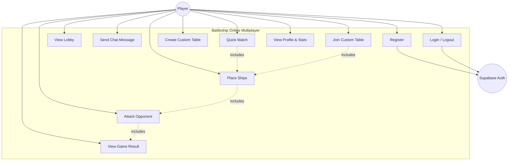

#### 3.4.2 Game State Machine Diagram

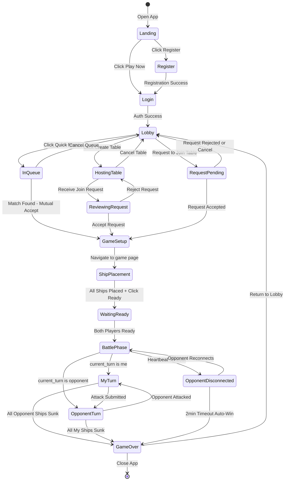

#### 3.4.3 Sequence Diagram — Attack Flow

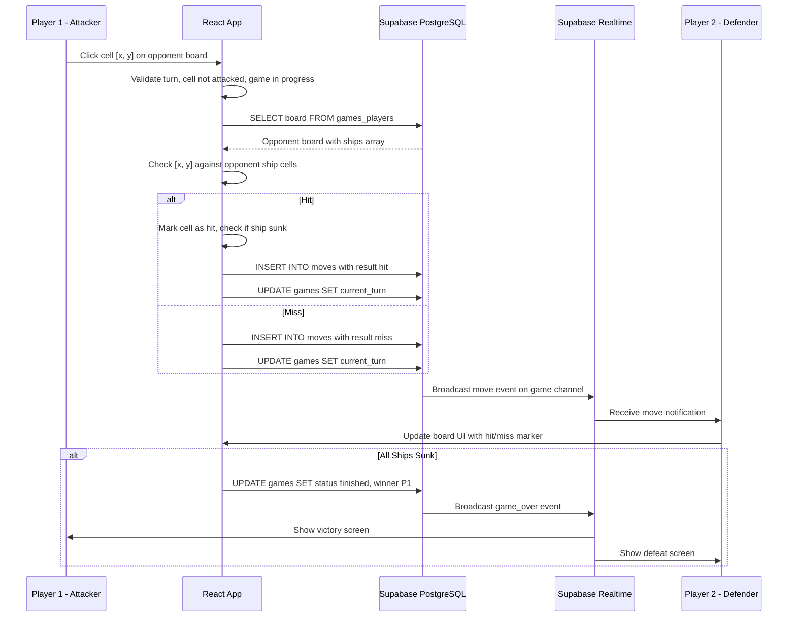

---

## 4. System Architecture & Design

### 4.1 Technology Stack

```
Frontend:    React 18 + TypeScript + Vite 6 + Tailwind CSS v4
Backend:     Supabase (PostgreSQL + Auth + Realtime WebSocket)
Hosting:     GitHub Pages (static SPA)
CI/CD:       GitHub Actions (auto-deploy on push to main)
```

### 4.2 Design Rationale

| Decision           | Choice                     | Rationale                                                                                 |
| ------------------ | -------------------------- | ----------------------------------------------------------------------------------------- |
| Frontend Framework | React 18                   | Industry standard, large ecosystem, team familiarity                                      |
| Language           | TypeScript                 | Type safety for complex game state, better DX with IDE support                            |
| Build Tool         | Vite 6                     | Fast HMR, native ESM, simpler config than Webpack                                         |
| CSS Framework      | Tailwind CSS v4            | Utility-first, rapid UI development, responsive design built-in                           |
| Backend            | Supabase                   | PostgreSQL + Auth + Realtime in one platform, generous free tier, no custom server needed |
| Hosting            | GitHub Pages               | Free, integrates with GitHub Actions, sufficient for static SPA                           |
| State Management   | React Context + useReducer | Lightweight, no external dependency, sufficient for this app's complexity                 |
| Routing            | React Router v7            | De facto standard for React SPAs                                                          |

### 4.3 Architecture Diagram

```
┌─────────────────────────────────────────────────────────────┐
│                     Client (Browser)                         │
│  ┌──────────┐  ┌──────────┐  ┌──────────┐  ┌──────────┐    │
│  │ Landing   │  │ Auth     │  │ Lobby    │  │ Game     │    │
│  │ Page      │  │ Pages    │  │ Page     │  │ Page     │    │
│  └──────────┘  └──────────┘  └──────────┘  └──────────┘    │
│       │              │             │              │          │
│  ┌──────────────────────────────────────────────────────┐   │
│  │           React Context (Auth + Game State)           │   │
│  └──────────────────────────────────────────────────────┘   │
│       │              │             │              │          │
│  ┌──────────────────────────────────────────────────────┐   │
│  │              Supabase Client SDK                      │   │
│  └──────────────────────────────────────────────────────┘   │
└───────────────────────────┬─────────────────────────────────┘
                            │ HTTPS + WebSocket
┌───────────────────────────┴─────────────────────────────────┐
│                      Supabase Cloud                          │
│  ┌──────────┐  ┌──────────┐  ┌──────────────────────────┐  │
│  │   Auth   │  │ Realtime │  │     PostgreSQL            │  │
│  │  (JWT)   │  │ (WS)     │  │  profiles, games,        │  │
│  │          │  │          │  │  games_players, moves,    │  │
│  │          │  │          │  │  tables, chat_messages,   │  │
│  │          │  │          │  │  matchmaking_queue        │  │
│  └──────────┘  └──────────┘  └──────────────────────────┘  │
└──────────────────────────────────────────────────────────────┘
```

### 4.4 Realtime Channel Architecture

| Channel            | Purpose                                 |
| ------------------ | --------------------------------------- |
| `lobby` (Presence) | Track online users and their status     |
| `lobby-chat`       | Chat message inserts                    |
| `lobby-tables`     | Table create/update/delete              |
| `table:{tableId}`  | Join requests for specific table        |
| `matchmaking`      | Queue changes, match notifications      |
| `game:{gameId}`    | Moves, ready status, game state changes |

### 4.5 Component Tree

```
App
├── LandingPage
├── LoginPage
├── RegisterPage
├── ProtectedRoute
│   ├── LobbyPage
│   │   ├── LobbyHeader
│   │   ├── LobbyStats
│   │   ├── OnlineUsersList
│   │   ├── QuickMatchButton
│   │   ├── CreateTableButton
│   │   ├── TableList
│   │   │   └── TableCard
│   │   ├── HostTableModal
│   │   │   └── RequestItem
│   │   └── LobbyChat
│   ├── GamePage
│   │   ├── TurnIndicator
│   │   ├── BoardGrid (x2: player + opponent)
│   │   │   └── BoardCell
│   │   └── GameEndModal
│   └── ProfilePage
├── AuthLayout
├── Modal
├── Button
├── Input
└── LoadingSpinner
```

---

## 5. Database Design

### 5.1 Entity Relationship Diagram

```
┌──────────────┐       ┌──────────────┐       ┌──────────────┐
│   PROFILES   │       │    GAMES     │       │    MOVES     │
├──────────────┤       ├──────────────┤       ├──────────────┤
│ id (PK)      │──┐    │ id (PK)      │──┐    │ id (PK)      │
│ email (UK)   │  │    │ table_id(FK) │  │    │ game_id (FK) │
│ display_name │  │    │ status       │  ├───>│ player_id(FK)│
│ total_games  │  │    │ current_turn │  │    │ x, y         │
│ wins, losses │  │    │ winner_id    │  │    │ result       │
│ created_at   │  │    │ created_at   │  │    │ sunk_ship    │
└──────────────┘  │    └──────────────┘  │    │ move_number  │
                  │           │          │    └──────────────┘
                  │           │ 1:N      │
                  │    ┌──────────────┐  │
                  │    │GAMES_PLAYERS │  │
                  │    ├──────────────┤  │
                  ├───>│ game_id (FK) │<─┘
                  │    │ player_id(FK)│
                  │    │ board (JSONB)│
                  │    │ ready        │
                  │    │ player_number│
                  │    └──────────────┘
                  │
                  │    ┌──────────────┐      ┌────────────────┐
                  │    │   TABLES     │      │TABLE_REQUESTS  │
                  │    ├──────────────┤      ├────────────────┤
                  ├───>│ host_id (FK) │──1:N>│ table_id (FK)  │
                  │    │ status       │      │ requester_id   │
                  │    └──────────────┘      │ status         │
                  │                          └────────────────┘
                  │
                  │    ┌──────────────┐      ┌────────────────┐
                  ├───>│CHAT_MESSAGES │      │MATCHMAKING_QUE │
                  │    ├──────────────┤      ├────────────────┤
                  │    │ sender_id(FK)│      │ player_id (FK) │
                  │    │ message      │      │ joined_at      │
                  │    │ channel      │      └────────────────┘
                  └───>│ created_at   │
                       └──────────────┘
```

### 5.2 Key Design Decisions

- **Board state as JSONB:** Ships array stored in `games_players.board` allows flexible board representation without a separate ships table
- **Move history table:** Every attack is recorded for potential replay functionality
- **Matchmaking queue:** Simple FIFO with `DELETE ... RETURNING` for atomic queue pop to prevent race conditions
- **Triggers:** Auto-create `profiles` row on `auth.users` insert via PostgreSQL trigger

---

## 6. Implementation

### 6.1 Feature Implementation Status

| Feature                           | Status    | Sprint |
| --------------------------------- | --------- | ------ |
| Landing Page                      | Completed | 1      |
| User Registration (Supabase Auth) | Completed | 1      |
| User Login / Logout               | Completed | 1      |
| Protected Routes                  | Completed | 1      |
| Lobby UI + Presence               | Completed | 1      |
| Lobby Chat (Realtime)             | Completed | 1      |
| CI/CD + GitHub Pages Deploy       | Completed | 1      |
| Quick Match (FIFO Matchmaking)    | Completed | 2      |
| Custom Tables + Join Requests     | Completed | 2      |
| Ship Placement (Drag & Drop)      | Completed | 2      |
| Attack Mechanism (Hit/Miss/Sunk)  | Completed | 2      |
| Realtime Move Sync                | Completed | 2      |
| Game End Detection + Stats        | Completed | 3      |
| Profile Page (Win/Loss)           | Completed | 3      |
| Heartbeat Disconnect Detection    | Completed | 3      |
| Mobile Responsive + Tab Switcher  | Completed | 3      |
| Ship SVG Visuals                  | Completed | 3      |

**All planned features were completed and deployed.**

### 6.2 Technical Challenges & Solutions

| Challenge                                                                    | Solution                                                                            |
| ---------------------------------------------------------------------------- | ----------------------------------------------------------------------------------- |
| **Matchmaking race condition** — two players popping the same queue entry    | Used `DELETE ... RETURNING` for atomic queue pop; added mutual-accept handshake     |
| **Realtime chat duplicates** — messages appearing twice                      | Switched from polling to Supabase Realtime subscription; removed stale polling code |
| **Move number race condition** — concurrent moves causing constraint errors  | Added `move_number` tracking with `upsert ignoreDuplicates`                         |
| **Mobile board overflow** — 10x10 grid exceeding viewport on small screens   | Implemented tab switcher for "My Board" vs "Enemy Board" on mobile                  |
| **Ghost matches** — matchmaking detecting offline users as available         | Added stale game filtering and offline player detection via Presence                |
| **Ship SVG displacement** — SVG overlays pushing grid cells out of alignment | Rendered ships as single continuous SVG per ship with absolute positioning          |

### 6.3 Design by Contract — Key Functions

Following the Design by Contract principles from Lecture 5, critical game functions have clear preconditions and postconditions:

**Ship Placement Validation (`gameLogic.ts`):**

- _Precondition:_ Exactly 5 ships with correct sizes, all cells within 0-9 bounds, no overlapping cells, cells are contiguous and match orientation
- _Postcondition:_ Board state is valid and ready for battle; `games_players.ready` set to `true`
- _Invariant:_ Total ship cells = 5 + 4 + 3 + 3 + 2 = 17

**Attack Resolution (`useGame.ts`):**

- _Precondition:_ Game status is `in_progress`, `current_turn` matches attacker's ID, target cell not previously attacked
- _Postcondition:_ Move recorded in `moves` table, `current_turn` switched to opponent, board UI updated
- _Invariant:_ Move count strictly increases; each cell attacked at most once

---

## 7. Open-Source Components

| Component             | Version | License    | Purpose                     |
| --------------------- | ------- | ---------- | --------------------------- |
| React                 | 18.x    | MIT        | UI framework                |
| React DOM             | 18.x    | MIT        | DOM rendering               |
| React Router          | 7.x     | MIT        | Client-side routing         |
| TypeScript            | 5.x     | Apache 2.0 | Type-safe JavaScript        |
| Vite                  | 6.x     | MIT        | Build tool and dev server   |
| Tailwind CSS          | 4.x     | MIT        | Utility-first CSS framework |
| @supabase/supabase-js | 2.x     | MIT        | Supabase client SDK         |

All dependencies use permissive open-source licenses (MIT / Apache 2.0) with no licensing conflicts. No components were copy-pasted; all are installed via npm
and imported through standard module resolution, following the **Adapter/Wrapper pattern** recommended in Lecture 6.

---

## 8. Sprint Management & Progress

### 8.1 Sprint Timeline

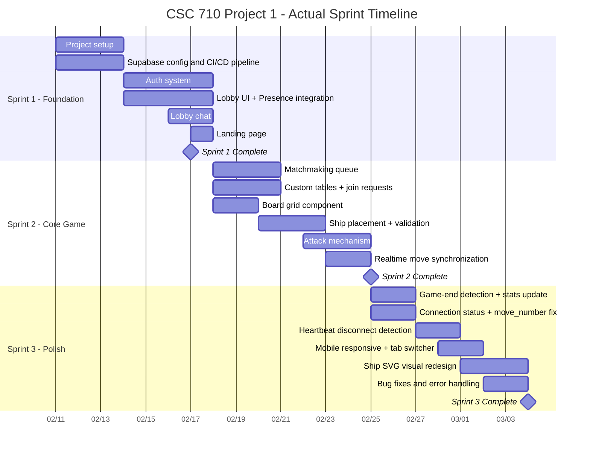

### 8.2 Sprint Backlog Summary

| Sprint    | Duration     | Story Points | Key Deliverables                                                  |
| --------- | ------------ | ------------ | ----------------------------------------------------------------- |
| Sprint 1  | Feb 11–17    | 14 SP        | Auth, Lobby, Chat, CI/CD, Landing Page                            |
| Sprint 2  | Feb 18–25    | 29 SP        | Matchmaking, Custom Tables, Ship Placement, Attack, Realtime Sync |
| Sprint 3  | Feb 25–Mar 4 | 14 SP        | Game End, Profiles, Disconnect Detection, Mobile, Ship Visuals    |
| **Total** | **3 weeks**  | **57 SP**    | **All features completed**                                        |

### 8.3 Velocity

| Sprint      | Planned SP | Completed SP | Velocity       |
| ----------- | ---------- | ------------ | -------------- |
| Sprint 1    | 14         | 14           | 14 SP/week     |
| Sprint 2    | 29         | 29           | 29 SP/week     |
| Sprint 3    | 14         | 14           | 14 SP/week     |
| **Average** |            |              | **19 SP/week** |

Sprint 2 had the highest velocity as the core game mechanics required the most effort and all three team members were working in parallel on different
subsystems.

---

## 9. Team Contributions

### 9.1 Git Statistics

| Team Member      | Commits | Lines Added | Lines Deleted | Key Contributions                                                                                                      |
| ---------------- | ------- | ----------- | ------------- | ---------------------------------------------------------------------------------------------------------------------- |
| **Merve Gazi**   | 37      | 4,815       | 1,014         | Matchmaking, board grid, presence, chat, responsive design, ship SVGs, heartbeat, mobile tab switcher                  |
| **Umut Celik**   | 26      | 3,736       | 474           | Auth system, routing, lobby UI, custom tables, attack mechanism, realtime sync, game-end stats, PR reviews             |
| **Justin Huang** | 10      | 4,621       | 615           | Project setup (React/Vite/Tailwind/Supabase), ship placement validation, game mechanics enforcement, matchmaking fixes |
| **Total**        | **73**  | **13,172**  | **2,103**     |                                                                                                                        |

### 9.2 Contribution Matrix by Feature

| Feature                     | Merve | Umut | Justin |
| --------------------------- | ----- | ---- | ------ |
| Project Setup & Config      |       |      | X      |
| Supabase Wiring & CI/CD     |       |      | X      |
| Auth (Login/Register)       |       | X    |        |
| Routing & Protected Routes  |       | X    |        |
| Lobby UI & Presence         | X     | X    |        |
| Lobby Chat                  | X     | X    |        |
| Quick Match (Matchmaking)   | X     |      | X      |
| Custom Tables               |       | X    | X      |
| Board Grid Component        | X     |      |        |
| Ship Placement & Validation |       |      | X      |
| Attack Mechanism            |       | X    |        |
| Realtime Move Sync          |       | X    |        |
| Game End + Stats            |       | X    |        |
| Heartbeat & Disconnect      | X     |      |        |
| Mobile Responsive           | X     |      |        |
| Ship SVG Visuals            | X     |      |        |
| Landing Page                |       | X    |        |
| Profile Page                |       | X    |        |

---

## 10. Known Issues & Bug Fixes

### 10.1 Bugs Encountered & Resolved

| Bug                                               | Severity | Sprint | Resolution                                                    |
| ------------------------------------------------- | -------- | ------ | ------------------------------------------------------------- |
| Chrome autofilling display name as login username | Low      | 2      | Added `autocomplete="off"` attribute                          |
| Chat messages appearing twice                     | Medium   | 2      | Replaced polling with Realtime subscription                   |
| Matchmaking detecting offline ghost players       | High     | 2      | Added stale game filtering + Presence-based offline detection |
| Both players not seeing match notification        | High     | 2      | Added polling fallback for race condition + match info UI     |
| Ship SVG overlays displacing grid cells           | Medium   | 3      | Used absolute positioning for SVG overlays                    |
| Board overflow on mobile screens                  | Medium   | 3      | Implemented tab switcher for My Board / Enemy Board           |
| `move_number` constraint error on duplicate moves | High     | 3      | Used `upsert` with `ignoreDuplicates` option                  |
| Viewport scroll issues on game page               | Medium   | 3      | Restored full-size boards with internal scroll                |

### 10.2 Demo Day Issues

During the in-class demo, several error-handling edge cases surfaced under live conditions. These were identified and fixed in the final sprint, including lobby
state cleanup on refresh and auto-dismissing stale notices.

<!-- TODO: Burada demo sırasında yaşanan spesifik sorunları ekleyebilirsin -->

### 10.3 Known Limitations

| Limitation                      | Reason                                                          | Mitigation                                                                                                    |
| ------------------------------- | --------------------------------------------------------------- | ------------------------------------------------------------------------------------------------------------- |
| No server-side move validation  | Client-side only (academic project, no Supabase Edge Functions) | Client validates turn order, cell uniqueness, game status                                                     |
| No Row Level Security (RLS)     | Development speed trade-off                                     | Application-level access control; opponent board data is theoretically accessible via direct Supabase queries |
| No rate limiting on chat        | No server-side enforcement                                      | Client-side throttle (1 msg/sec), max 500 chars                                                               |
| Reconnect window is best-effort | Heartbeat-based detection, not guaranteed                       | 10s heartbeat, 30s stale threshold, 2-min reconnect window                                                    |

---

## 11. Sprint Retrospective

### Sprint 1 (Feb 11–17): Foundation

| What Went Well                                              | What Didn't Go Well                                          |
| ----------------------------------------------------------- | ------------------------------------------------------------ |
| Tech stack decisions were made quickly and proved effective | Initial Supabase Realtime configuration had a learning curve |
| CI/CD pipeline was set up early, enabling fast iteration    |                                                              |

### Sprint 2 (Feb 18–25): Core Game

| What Went Well                                             | What Didn't Go Well                                             |
| ---------------------------------------------------------- | --------------------------------------------------------------- |
| Parallel development on different subsystems was efficient | Matchmaking race conditions required multiple iterations to fix |
| Pull request workflow caught issues before merging         | Chat duplicate messages took debugging effort                   |

### Sprint 3 (Feb 25–Mar 4): Polish

| What Went Well                                                                           | What Didn't Go Well                                                                                       |
| ---------------------------------------------------------------------------------------- | --------------------------------------------------------------------------------------------------------- |
| Delivered a fully working, deployable product aligned with the technical design document | Some game mechanics were not defined in the original document and had to be updated during the final week |
| All planned features were completed                                                      | Demo day exposed error-handling edge cases that needed last-minute fixes                                  |

### Overall Improvements for Project 2

- Define all game mechanics thoroughly in the design document before implementation begins
- Add automated tests early to catch regressions
- Set up more granular error handling from the start

---

## 12. Future Work (Project 2)

Project 2 will extend this Battleship project as a **Brownfield Development** effort, adding the following features:

| Feature                       | Description                                                                   | Estimated SP |
| ----------------------------- | ----------------------------------------------------------------------------- | ------------ |
| **AI Opponent**               | Single-player mode against a computer opponent with varying difficulty levels | 13           |
| **Custom Maps**               | Different grid sizes and map layouts for varied gameplay                      | 8            |
| **Sound Effects**             | Audio cues for hit, miss, sunk, victory, and defeat                           | 3            |
| **Enhanced Visuals**          | Explosion animations, water splash effects, improved ship graphics            | 5            |
| **Additional Game Mechanics** | New ship types, power-ups, or special abilities                               | 8            |

---

## 13. Lessons Learned

<!-- TODO: Burayı kendi kelimeleriyle 3-5 madde ekleyebilirsin -->

1. **Supabase Realtime is powerful but has edge cases.** Race conditions in matchmaking and move synchronization required creative solutions like mutual-accept
   handshakes and upsert with `ignoreDuplicates`.

2. **Define game mechanics completely before coding.** Several mechanics (like one-ship-per-turn placement, mutual match acceptance) were not in the original
   design document and had to be added during implementation.

3. **Mobile-first design saves rework.** The 10x10 grid overflow issue on mobile required significant refactoring in Sprint 3. Starting with mobile constraints
   would have prevented this.

4. **CI/CD from day one pays off.** Having GitHub Actions deploy to GitHub Pages automatically on every push to main allowed the team to demo progress
   continuously.

5. **Leveraging team members' domain expertise accelerates delivery.** Having a teammate who already understood Battleship game mechanics meant the team could
   skip lengthy requirements elicitation and focus on implementation. In cross-functional teams, recognizing and utilizing each member's strengths — whether in
   game design, architecture, or frontend development — leads to more efficient task distribution and higher quality output.

---

## 14. Screenshots

### 14.1 Landing Page

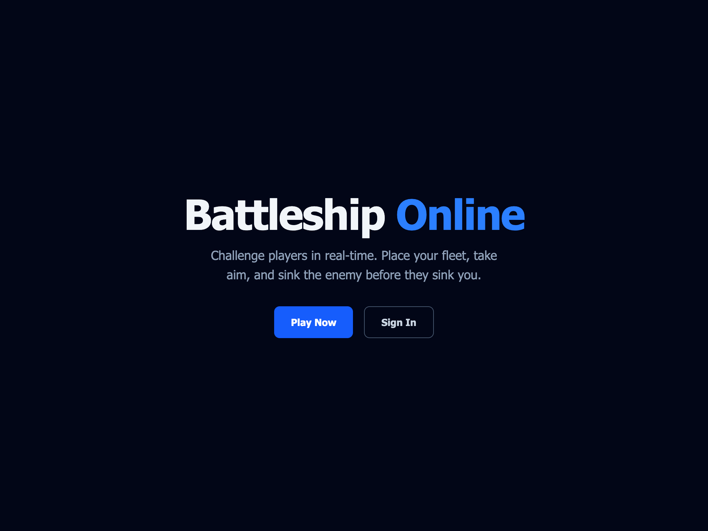

Dark navy blue theme with "Battleship Online" title, "Play Now" and "Sign In" call-to-action buttons.

### 14.2 Login Page

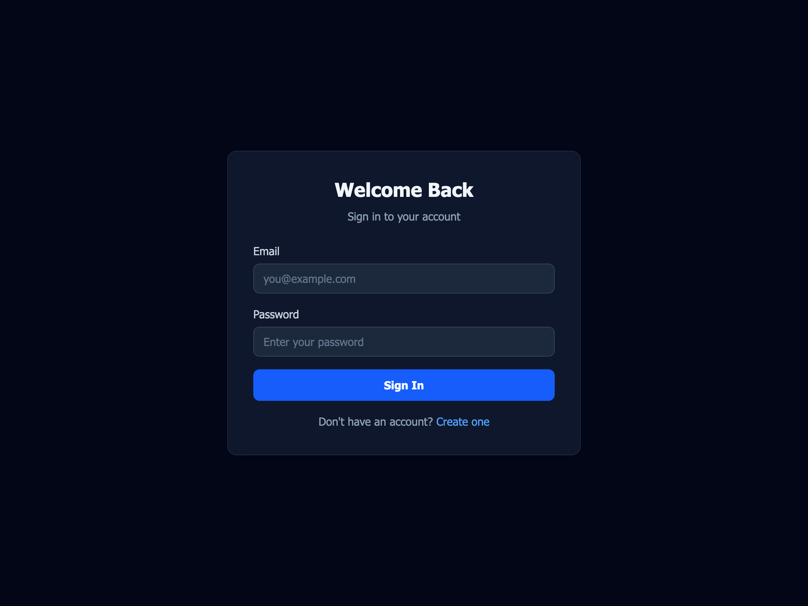

"Welcome Back" login form with email and password fields.

### 14.3 Register Page

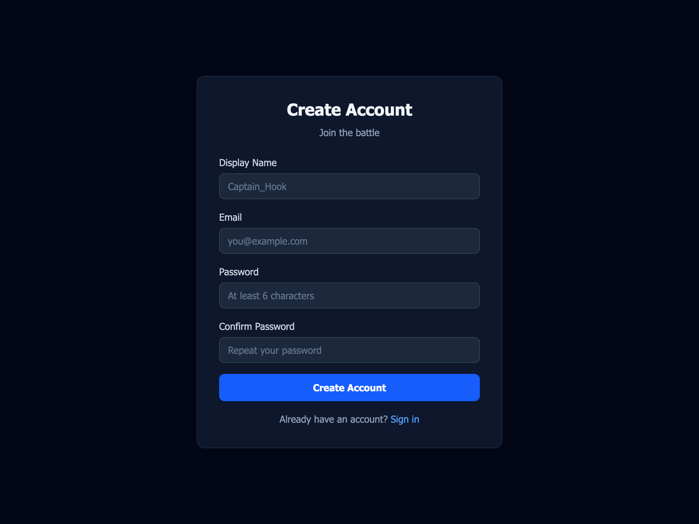

"Create Account" form with display name, email, password, and confirm password fields.

### 14.4 Lobby (Chat + Online Users + Tables)

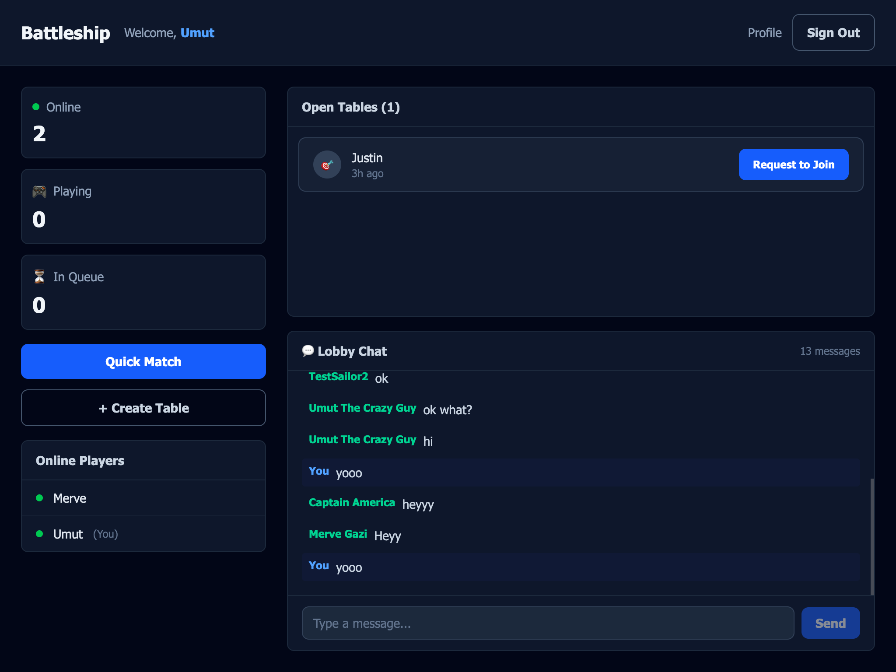

Full lobby view showing online player count, Quick Match button, open tables list, and real-time lobby chat panel.

### 14.5 Ship Placement Phase (Empty Board)

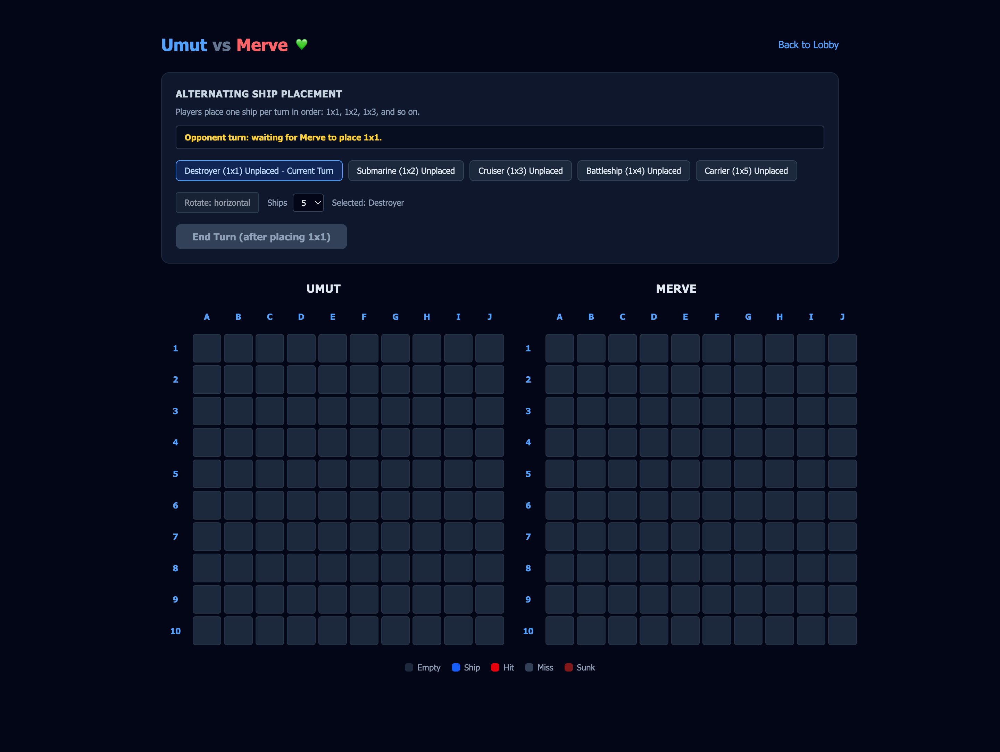

Game setup screen showing two empty 10x10 grids, alternating ship placement panel with all ships unplaced.

### 14.6 Ship Placement Phase (In Progress)

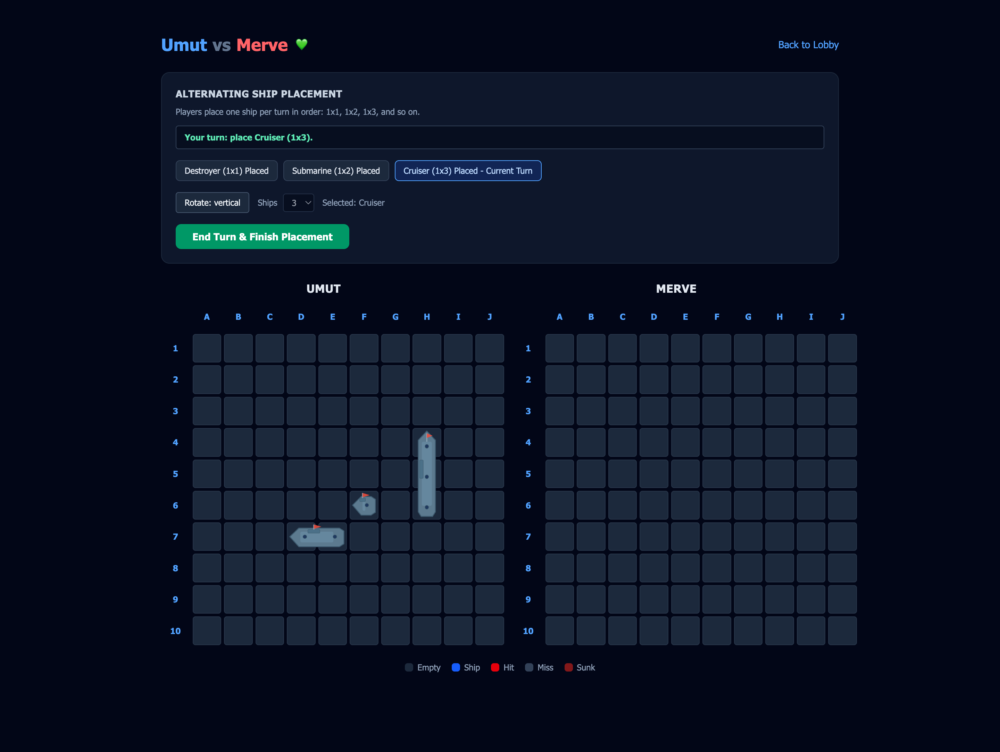

Ships being placed with SVG visuals — Destroyer and Submarine placed, Cruiser selected as current turn.

### 14.7 Game End — Victory Screen

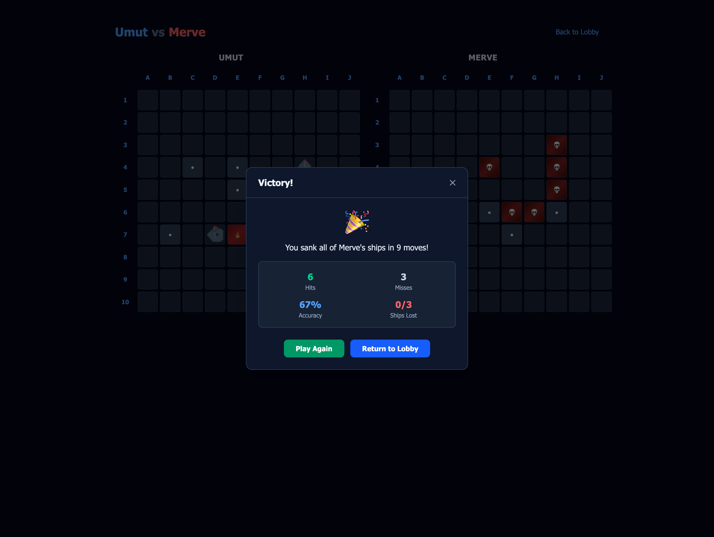

Victory modal overlay showing battle statistics: 9 moves, 6 hits, 3 misses, 67% accuracy. Both boards visible in background with hit/miss markers.

### 14.8 Profile Page

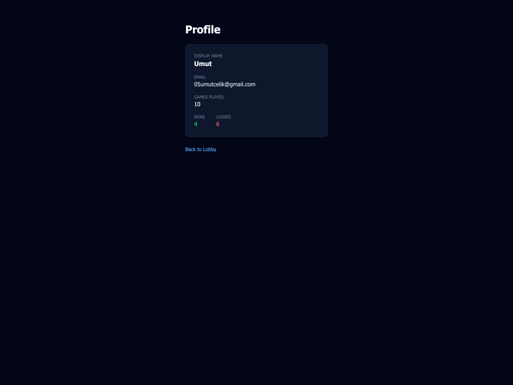

Player profile card displaying display name, email, games played (10), wins (4), and losses (6).

---

## References

- Sommerville, I. (2016). _Software Engineering_ (10th ed.). Pearson.
- Pressman, R. S. & Maxim, B. R. (2020). _Software Engineering: A Practitioner's Approach_ (9th ed.). McGraw-Hill.
- IEEE Computer Society. (2014). _SWEBOK V3.0: Guide to the Software Engineering Body of Knowledge_.
- Supabase Documentation. <https://supabase.com/docs>
- React Documentation. <https://react.dev>
- Tailwind CSS Documentation. <https://tailwindcss.com/docs>
